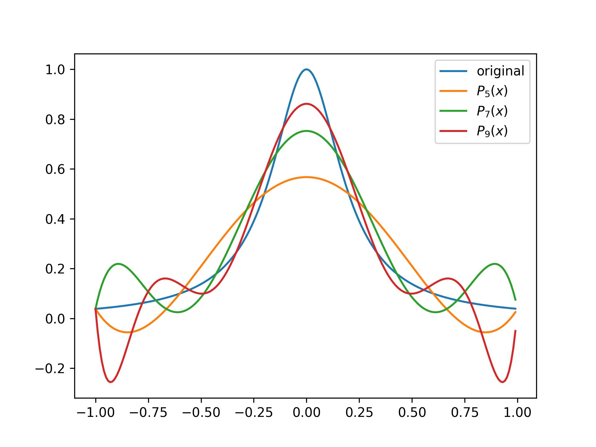

# Numerical method tool box

## Numerical methods

|        |  1D Advection Equation | 1D Diffusion Equation|
|  ----  | ----                   | ----            |
|Equation| $\frac{\partial u}{\partial t}+c\frac{\partial u}{\partial x}=0$ | $K \frac{\partial^2 u}{\partial x^2} + r(x) = 0$ |
| FDM | [code](./FDM_LinearAdvection.py) with comparison of backward and centred method |[code](./FDM_Diffusion.py)|  |
|DG/FEM| [code](./DG_LinearAdvection.py) | [code](./FEM_LinearDiffusion.py) |
| FVM | ||

- [Poiseuille flow with LBM](./LBM_Poiseuille.py)
## Tools/Phenomenons
- [Runge's phenomenon](./Runge_phenomenon.py) and its remedies

